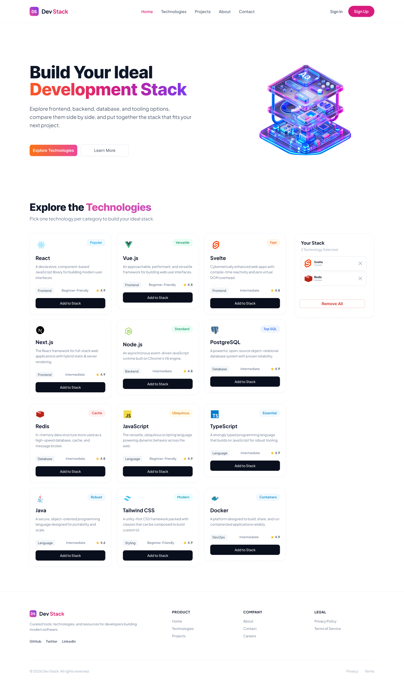
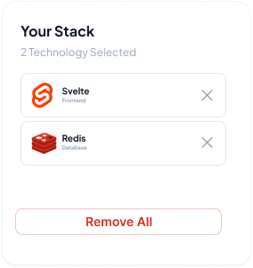
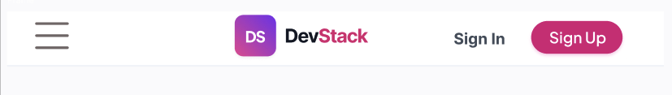

# 🧱 Dev Stack

**Dev Stack** is a React web app that helps developers explore frontend,
backend, database, language, styling, and DevOps technologies, and build a
personal "stack" by picking the tools they'd use on their next project.
Browse a catalog of technologies with ratings and difficulty levels, add the
ones you like to your stack, and manage your selections in a live sidebar —
all backed by a local JSON dataset and a shared orange → pink → violet
gradient brand theme.



## 🚀 Live Demo & Repository

- **Live Site:** https://dev-stack-eta.vercel.app
- **Repository:** https://github.com/mehadeehassan/Dev-Stack

## 🛠️ Technology Used

- **React 19** (function components + hooks)
- **TypeScript**
- **Vite** — dev server and build tool
- **Tailwind CSS v4** — utility-first styling only (no custom CSS rules; shared
  gradient/focus classes are composed Tailwind utility strings in `src/theme.ts`)
- **React-Toastify** — toast notifications for stack actions
- **JSON** — local technology dataset, loaded via `fetch`

## ✨ Features

### 1. Interactive technology catalog
14 technologies across 7 categories (Frontend, Backend, Database, Language,
Styling, DevOps, Tools) rendered in a responsive 1 / 2 / 3-column grid, each
card showing an icon, badge, rating, difficulty, and category chip.


### 2. Build-your-stack workflow
Clicking "Add to Stack" moves a technology into the "Your Stack" sidebar,
disables that card's button, and prevents duplicate adds with a warning
toast. A selected card gets a highlighted pink border and its button
switches to a light pink "✓ Added to Stack" state, so the selection is
visible at a glance. Items can be removed individually or all at once, each
action confirmed with a toast notification.



### 3. Consistent gradient brand theme
A single set of Tailwind utility strings (`GRADIENT_BG` / `GRADIENT_TEXT` in
`src/theme.ts`) drives the brand name, the hero heading highlight, and every
primary button, so the whole UI can be re-themed by changing one place — no
custom CSS involved.



## 📦 Getting Started

```bash
npm install
npm run dev        # start the dev server
npm run typecheck  # TypeScript check only
npm run build      # type-check + production build
```

The technology data lives in `public/data/technologies.json` and is fetched
at runtime (not hardcoded into a component), so a loading state renders while
it's being fetched. The fetch runs directly inside `App.tsx` with
`useState`/`useEffect` — there's no separate custom hook file.

## 📁 Project Structure

```
public/
  data/technologies.json   # technology dataset
src/
  components/
    Navbar.tsx              # sticky nav + mobile hamburger menu
    Hero.tsx                # banner / hero section
    TechnologiesSection.tsx # grid + sidebar layout, loading & error states
    TechCard.tsx             # individual technology card (conditional selected style)
    StackSidebar.tsx        # "Your Stack" panel
    Footer.tsx
  App.tsx                    # fetches JSON (useState/useEffect) + stack state
  theme.ts                   # shared Tailwind utility strings (gradient, focus ring)
  types.ts                   # Technology type definition
  index.css                  # single line: @import "tailwindcss";
```

## ❓ React Questions & Answers

### 1. What is JSX and why do we use it in React?

JSX stands for JavaScript XML. It allows us to write HTML-like code inside JavaScript. It makes React code easier to read and helps us create UI components more easily.

### 2. What are the main differences between props and state?

Props are used to pass data from a parent component to a child component, while state is used to manage data inside a component. Props are read-only, but state can be changed using a state update function.

### 3. What is `useState` used for? Where did you use it in this project?

`useState` is a React Hook used to manage changing data inside a component. In this project, I used it for managing the technology data, selected stack items, loading state, and mobile menu state.

### 4. What is `useEffect` used for? Why did you use it to fetch the JSON data?

`useEffect` is used to handle side effects in React. I used it to fetch the technology data from the JSON file when the component loads.

### 5. Why do we need a unique `key` when rendering items with `.map()`?

React uses the `key` to uniquely identify each item in a list. It helps React understand which items have changed, been added, or removed, so it can update the UI efficiently.

### 6. What is conditional rendering? Where did you use it in this project?

Conditional rendering means showing different UI elements based on a condition. In this project, I used it in the Stack section. When no technology is selected, an empty stack message is shown. When technologies are selected, the selected items are displayed.

### 7. How can a parent send data to a child component, and how can the child communicate back to the parent?

A parent component can send data to a child component using props. A child can communicate back to the parent by calling a callback function passed through props. In this project, the parent handles the stack data and passes the required data and functions to the child components.
